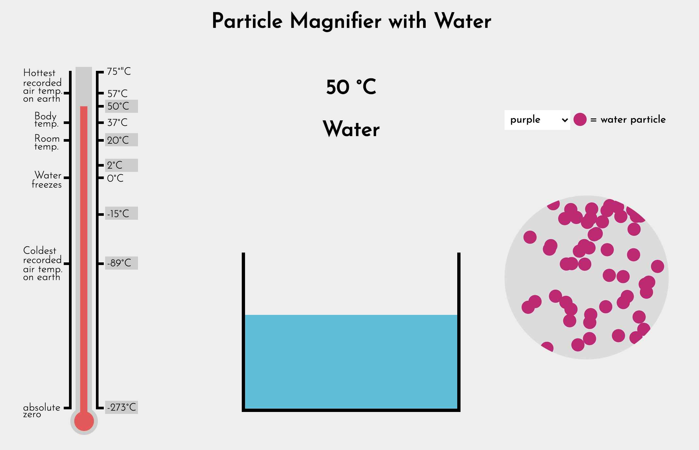

# The Inquiry Project: Particle Magnifier
Particle magnifier/behavior module taht allows students to observe the arrangement and motion of water particles in solid, liquid, and gaseous states. 

The user can select one of six different temperatures on the thermometer to observe how particles respond to different amounts of heat energy.

